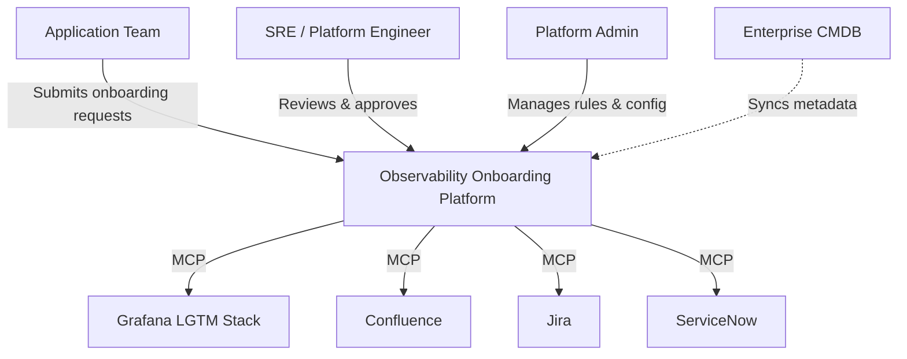
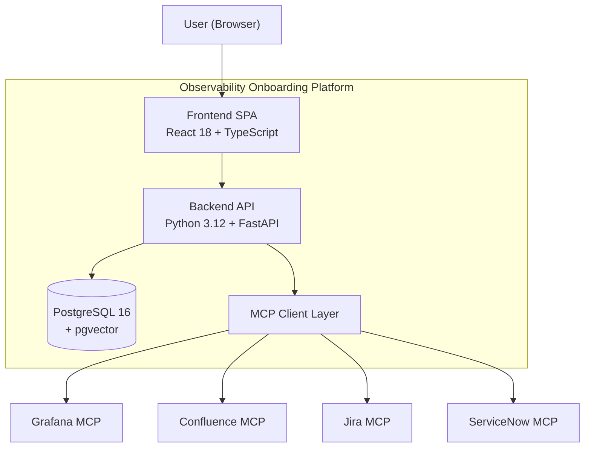

# Architecture Documentation

> C4-style architecture documentation for the Next-Gen Observability Onboarding Platform.

---

## Table of Contents

1. [Overview](#overview)
2. [System Context (Level 1)](#system-context-level-1)
3. [Container Diagram (Level 2)](#container-diagram-level-2)
4. [Component Diagram (Level 3)](#component-diagram-level-3)
5. [Technology Choices and Rationale](#technology-choices-and-rationale)
6. [Data Flow for Key Workflows](#data-flow-for-key-workflows)

---

## Overview

The Next-Gen Observability Onboarding Platform is an enterprise-grade self-service system that automates the onboarding of applications onto a Grafana LGTM (Loki, Grafana, Tempo, Mimir) observability stack. It replaces manual spreadsheet-driven processes with a 9-step guided wizard, automated capacity planning, governance validation, similarity-based recommendations, and artifact generation integrated with Jira, ServiceNow, and Confluence via Model Context Protocol (MCP) servers.

---

## System Context (Level 1)

> See: [`docs/diagrams/system-context.mermaid`](diagrams/system-context.mermaid)



### Actors

| Actor | Role | Interaction |
|-------|------|-------------|
| **Application Team** | Developers and tech leads who own applications | Fill the 9-step onboarding wizard, select telemetry signals, review capacity results, and submit requests |
| **SRE / Platform Engineer** | Site reliability engineers who manage the observability stack | Review capacity assessments, approve onboarding requests, monitor governance compliance |
| **Platform Admin** | Operations staff managing the platform itself | Configure governance rules, manage lookup data (portfolios, tech stacks, platforms), monitor system health |

### External Systems

| System | Purpose | Integration Pattern |
|--------|---------|-------------------|
| **Grafana LGTM Stack** | Mimir (metrics), Loki (logs), Tempo (traces), Pyroscope (profiles) | Grafana MCP Server for usage queries, datasource provisioning, dashboard management |
| **Confluence** | Enterprise wiki for runbooks and architecture documentation | Confluence MCP Server for automated page creation from templates |
| **Jira** | Project tracking for change requests, epics, stories, and tasks | Jira MCP Server for ticket creation and lifecycle management |
| **ServiceNow** | ITSM platform for change tasks (CTASKs) and CMDB records | ServiceNow MCP Server for CTASK creation and CMDB synchronization |
| **Enterprise CMDB** | Source of truth for application metadata (app codes, portfolios, owners) | Periodic batch sync into the `application_metadata` table |

---

## Container Diagram (Level 2)

> See: [`docs/diagrams/container-diagram.mermaid`](diagrams/container-diagram.mermaid)



### Container Details

#### Frontend SPA

| Attribute | Value |
|-----------|-------|
| **Technology** | React 18, TypeScript 5.6, Vite 5.4 |
| **Styling** | TailwindCSS 3.4, clsx, tailwind-merge |
| **State Management** | Zustand 4.5 |
| **Forms** | React Hook Form 7.54 + Zod validation |
| **Routing** | React Router DOM 6.28 |
| **HTTP Client** | Axios 1.7 |
| **Port** | 3000 (development) |

Key frontend features:
- **Onboarding Wizard** (`/onboarding/new`, `/onboarding/:id`): 9-step form with validation, auto-save, and step navigation
- **Dashboard** (`/`): Overview of onboarding requests, statuses, and recent activity
- **Capacity Dashboard** (`/capacity`): Visualization of capacity utilization across LGTM backends
- **Admin Panel** (`/admin`): Governance rule management, lookup data CRUD, system configuration

#### Backend API

| Attribute | Value |
|-----------|-------|
| **Technology** | Python 3.12, FastAPI 0.115, Pydantic v2, SQLAlchemy 2.0 (async) |
| **Database Driver** | asyncpg 0.30 (async PostgreSQL) |
| **Migrations** | Alembic 1.14 |
| **HTTP Client** | aiohttp 3.11 (for MCP calls) |
| **Retry/Resilience** | tenacity 9.0 |
| **Template Engine** | Jinja2 3.1 (artifact generation) |
| **Observability** | structlog 24.4 (structured logging), prometheus-client 0.21 (metrics) |
| **Vector Search** | pgvector 0.3.5 |
| **Port** | 8000 |

The backend follows a layered architecture:
1. **API Layer** (FastAPI routers) -- HTTP transport, request/response serialization
2. **Service Layer** -- Business logic orchestration, transaction management
3. **Engine Layer** -- Pure domain logic (capacity calculations, governance rules)
4. **Repository Layer** -- Data access via SQLAlchemy 2.0 async sessions
5. **MCP Client Layer** -- External system integration via HTTP

#### PostgreSQL 16 + pgvector

| Attribute | Value |
|-----------|-------|
| **Image** | pgvector/pgvector:pg16 |
| **Extensions** | pgvector (similarity search), gen_random_uuid() |
| **Port** | 5432 |
| **Pool Size** | 10 connections (configurable, max 100) |
| **Max Overflow** | 20 connections (configurable, max 200) |

Tables: `onboarding_requests`, `telemetry_scopes`, `technical_configs`, `environment_readiness`, `capacity_assessments`, `similarity_matches`, `artifacts`, `application_metadata`, `audit_logs`.

#### MCP Client Layer

Each MCP client is an aiohttp-based HTTP client with:
- Retry logic via tenacity (exponential backoff, 3 retries)
- Circuit breaker pattern for fault isolation
- Structured error mapping to `MCPClientError` exceptions
- API key authentication via `SecretStr` configuration
- Configurable base URLs per environment

---

## Component Diagram (Level 3)

> See: [`docs/diagrams/component-diagram.mermaid`](diagrams/component-diagram.mermaid)

### API Layer (FastAPI Routers)

| Router | Base Path | Responsibility |
|--------|-----------|---------------|
| **Health** | `/api/v1/health`, `/api/v1/ready` | Liveness and readiness probes |
| **Onboarding** | `/api/v1/onboarding` | CRUD operations for onboarding requests |
| **Capacity** | `/api/v1/capacity` | Capacity check initiation and status queries |
| **Similarity** | `/api/v1/similarity` | Vector-based similarity search |
| **Artifact** | `/api/v1/artifacts` | Artifact generation, preview, and retrieval |
| **Governance** | `/api/v1/governance` | Governance validation and rule listing |
| **Lookup** | `/api/v1/lookup` | Reference data (portfolios, tech stacks, platforms) |

### Service Layer

| Service | Dependencies | Responsibility |
|---------|-------------|---------------|
| **OnboardingService** | OnboardingRepo, AuditRepo | Orchestrates wizard flow, manages status transitions, enforces state machine constraints |
| **CapacityService** | CapacityEngine, CapacityRepo, GrafanaMCPClient | Fetches current usage from Grafana, delegates to capacity engine, persists assessments |
| **SimilarityService** | SimilarityRepo | Executes pgvector cosine similarity queries, ranks and persists matched applications |
| **ArtifactService** | ArtifactRepo, JiraClient, ConfluenceClient, ServiceNowClient | Generates artifact payloads via Jinja2 templates, syncs to external systems via MCP |
| **GovernanceService** | GovernanceEngine | Runs all governance rules against onboarding data, returns aggregate results |
| **LookupService** | AppMetadataRepo | Queries and caches reference data (portfolios, tech stacks, hosting platforms) |

### Engine Layer

The engine layer contains pure domain logic with no I/O dependencies:

- **Capacity Engine**: Evaluates per-signal capacity using threshold-based decision logic. Computes projected usage percentages, applies headroom factors, and produces traffic-light statuses (GREEN/AMBER/RED) with corresponding decisions (ALLOW/ALLOW_MONITOR/ALLOW_NOTIFY/BLOCK).

- **Governance Engine**: Iterates over a registry of `BaseRule` subclasses. Each rule receives onboarding data and returns an optional `Violation`. Results are aggregated into a `GovernanceResult` with a numeric score (0-100) and categorized violations (HARD vs. SOFT).

- **Rule Registry**: Auto-discovered collection of all governance rules (GOV-001 through GOV-007 for HARD rules, GOV-101 through GOV-105 for SOFT rules). See [GOVERNANCE_RULES.md](GOVERNANCE_RULES.md) for the complete rule catalog.

### Repository Layer

All repositories use SQLAlchemy 2.0 async sessions with the Unit of Work pattern:

| Repository | ORM Model | Key Operations |
|------------|-----------|---------------|
| **OnboardingRepo** | `OnboardingRequest` | Create, read, update, delete, list with filtering/pagination, status transitions |
| **CapacityRepo** | `CapacityAssessment` | Create, read by onboarding request ID |
| **SimilarityRepo** | `SimilarityMatch` | Bulk create, read by onboarding request ID, vector similarity query |
| **ArtifactRepo** | `Artifact` | Create, read, update status, read by onboarding request ID |
| **AuditRepo** | `AuditLog` | Append-only create, read by entity/actor/time range |
| **AppMetadataRepo** | `ApplicationMetadata` | Read, list, search by app code/portfolio |

### MCP Client Layer

| Client | Target MCP Server | Operations |
|--------|--------------------|-----------|
| **GrafanaMCPClient** | `GRAFANA_MCP_URL` (default: :8100) | Query current usage per signal, provision datasources, manage dashboards |
| **ConfluenceMCPClient** | `CONFLUENCE_MCP_URL` (default: :8101) | Create runbook pages from templates, update existing pages |
| **JiraMCPClient** | `JIRA_MCP_URL` (default: :8102) | Create epics, stories, tasks; update ticket status; link related items |
| **ServiceNowMCPClient** | `SERVICENOW_MCP_URL` (default: :8103) | Create change tasks (CTASKs), synchronize CMDB records |

---

## Technology Choices and Rationale

### Backend

| Technology | Rationale |
|-----------|-----------|
| **Python 3.12** | Latest stable release with performance improvements; strong async ecosystem; team familiarity |
| **FastAPI** | Native async support, automatic OpenAPI spec generation, Pydantic integration for request/response validation, high performance |
| **Pydantic v2** | 5-50x faster than v1 for serialization; strict mode support; clean settings management via pydantic-settings |
| **SQLAlchemy 2.0 (async)** | Industry-standard ORM with first-class async support; declarative mapping; type-safe queries |
| **asyncpg** | Fastest PostgreSQL driver for Python; native async; prepared statement caching |
| **pgvector** | PostgreSQL extension for vector similarity search; eliminates need for a separate vector database |
| **structlog** | Structured logging with JSON output; context variables; clean integration with stdlib logging |
| **prometheus-client** | Industry-standard metrics exposition; direct integration with Grafana LGTM stack |
| **tenacity** | Declarative retry policies with exponential backoff; circuit breaker support |
| **Jinja2** | Powerful template engine for artifact payload generation; familiar syntax |

### Frontend

| Technology | Rationale |
|-----------|-----------|
| **React 18** | Component model, Suspense for code splitting, concurrent features, vast ecosystem |
| **TypeScript 5.6** | Type safety, IDE support, refactoring confidence |
| **Vite 5.4** | Near-instant dev server startup, optimized builds, native ESM support |
| **TailwindCSS 3.4** | Utility-first CSS, consistent design system, rapid prototyping, small bundle size with PurgeCSS |
| **Zustand** | Minimal boilerplate state management; no providers needed; excellent TypeScript support |
| **React Hook Form + Zod** | Performant form handling with schema-based validation; minimal re-renders |
| **Axios** | Request/response interceptors for auth and error handling; cancellation support |

### Infrastructure

| Technology | Rationale |
|-----------|-----------|
| **PostgreSQL 16** | Mature, reliable RDBMS; JSON columns for flexible schemas; pgvector extension for embeddings |
| **Docker Compose** | Simple local development orchestration for all services |
| **Kubernetes** | Production-grade container orchestration; horizontal scaling; rolling deployments |
| **Helm** | Templated Kubernetes manifests; environment-specific value overrides; release management |

---

## Data Flow for Key Workflows

### 1. New Onboarding Request (Happy Path)

```
User -> Frontend -> POST /api/v1/onboarding (draft)
                 -> PUT  /api/v1/onboarding/{id} (update profile + signals)
                 -> POST /api/v1/capacity/check
                    -> Grafana MCP: query current usage
                    -> Capacity Engine: evaluate thresholds
                    -> DB: persist assessment
                 -> POST /api/v1/similarity/search
                    -> DB: pgvector cosine similarity
                    -> DB: persist matches
                 -> POST /api/v1/governance/validate
                    -> Governance Engine: run all rules
                 -> POST /api/v1/artifacts/generate
                    -> Jira MCP: create Epic + Stories
                    -> ServiceNow MCP: create CTASKs
                    -> Confluence MCP: create runbook
                    -> DB: persist artifacts
                 -> PUT  /api/v1/onboarding/{id} (status=submitted)
                    -> DB: update status + audit log
```

### 2. Capacity Check with RED Result

```
Frontend -> POST /api/v1/capacity/check
Backend  -> Grafana MCP: query usage
         -> Capacity Engine:
            - Signal "metrics": projected 92% -> RED/BLOCK
            - Signal "logs": projected 45% -> GREEN/ALLOW
         -> overall_status = RED (worst of all signals)
         -> overall_decision = BLOCK
         -> recommendations = ["Scale Mimir cluster", "Review metric cardinality"]
         -> DB: persist with escalation_required=true
Frontend <- { overall_status: "RED", can_proceed: false, escalation_required: true }
         -> Display block message with escalation link
```

### 3. Governance Validation with HARD Violation

```
Frontend -> POST /api/v1/governance/validate
Backend  -> Governance Engine:
            - GOV-001 (alert owner required): PASS
            - GOV-003 (production requires all signals): FAIL (HARD)
            - GOV-102 (naming convention): FAIL (SOFT)
         -> GovernanceResult:
            - passed: false
            - score: 65
            - hard_violations: [GOV-003]
            - soft_violations: [GOV-102]
Frontend <- { passed: false, score: 65, hard_violations: [...], soft_violations: [...] }
         -> Block submission, show GOV-003 violation with remediation steps
```

### 4. Similarity Search

```
Frontend -> POST /api/v1/similarity/search { app_code, tech_stack, hosting_platform }
Backend  -> Generate embedding vector from onboarding attributes
         -> DB: SELECT ... ORDER BY embedding <=> query_vector LIMIT 5
         -> For each match:
            - Retrieve exporters, dashboards, alert_rules, playbooks
            - Calculate match_reasons
         -> DB: INSERT similarity_matches
Frontend <- { matches: [{ app: "payments-api", score: 0.94, exporters: [...], ... }] }
```
