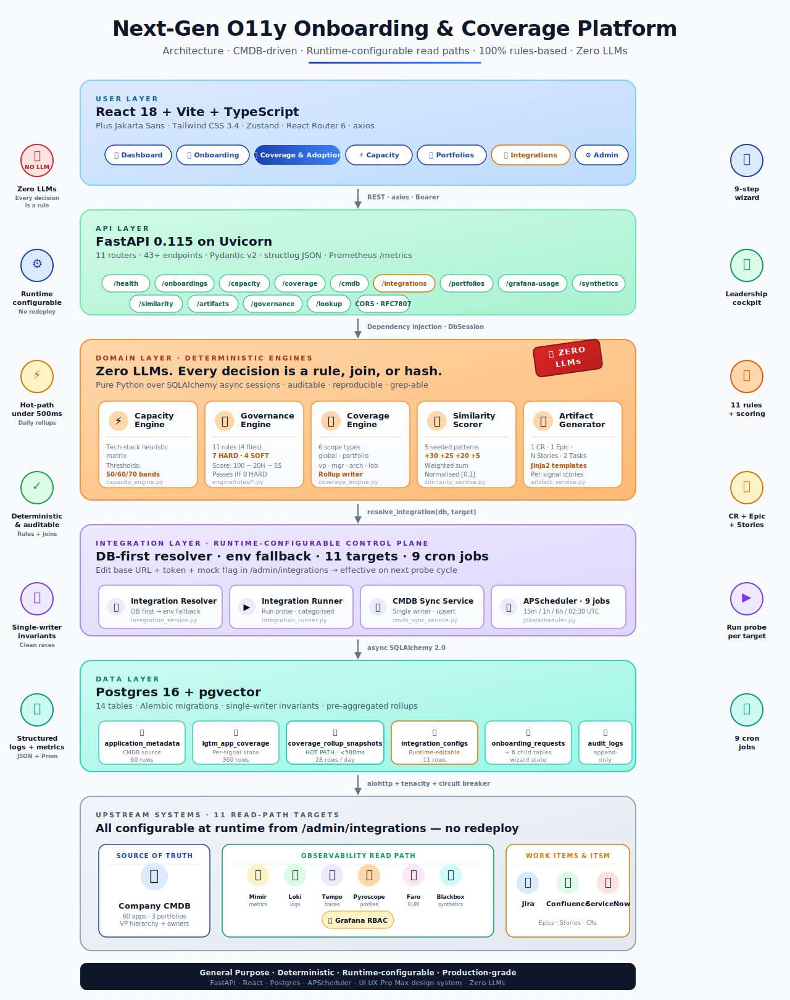

# Architecture Overview

<p align="center">
  
</p>

## 30,000-ft view

The platform is a single FastAPI backend, a single React frontend, a single Postgres database, and one scheduler running nine cron jobs inside the backend process. Everything else — the eleven upstream integrations, the tenant LGTM stack — is external and reached through an HTTP resolver layer.

```
┌────────────────────────────────────────────────────────────────┐
│                         React 18 + Vite                       │
│                                                                │
│  Dashboard · Onboarding · Coverage · Capacity · Catalog       │
│  Portfolios · Grafana Usage · Integrations · Admin             │
└──────────────────────────┬─────────────────────────────────────┘
                           │ axios · CORS localhost:3000-3002/5173-5174
                           ▼
┌────────────────────────────────────────────────────────────────┐
│                      FastAPI 0.115 (Uvicorn)                   │
│                                                                │
│  ┌──────────────┐   11 routers under /api/v1                   │
│  │ APScheduler  │ ─ onboarding · capacity · coverage            │
│  │  9 cron      │   cmdb · integrations · portfolios            │
│  │  jobs        │   grafana-usage · synthetics · lookup         │
│  └──────────────┘   similarity · artifacts · governance         │
│                                                                │
│  Engines:    capacity · governance · coverage                  │
│  Services:   cmdb_sync · integration_runner · artifact         │
│              capacity_stack · integration_service · notif      │
│                                                                │
│  Integration resolver → DB first, env fallback                │
│  → ResolvedIntegration(base_url, auth_token, use_mock, …)     │
└──────────┬──────────┬──────────┬──────────┬───────────────────┘
           │          │          │          │
           ▼          ▼          ▼          ▼
     ┌──────────┐ ┌──────┐ ┌──────┐ ┌──────────┐
     │ Postgres │ │ CMDB │ │ LGTM │ │  Jira /  │
     │   pg16 + │ │ /v1  │ │ stack│ │Confluence│
     │ pgvector │ └──────┘ │ /api │ │ ServiceNow│
     │          │          └──────┘ └──────────┘
     │ 14 tables│
     │ ~60 apps │
     │ ~360 cov │
     │  rows    │
     └──────────┘
```

## Layers

### 1. Presentation (React 18 + Vite)

- Routes in `frontend/src/App.tsx`
- State: Zustand stores per feature
- Typography: Plus Jakarta Sans (from the UI UX Pro Max skill's Analytics Dashboard recommendation)
- Colour: CSS variables under `data-theme="light|dark|grafana|midnight"` — one line to flip
- All API calls go through `frontend/src/api/client.ts` (axios instance with Bearer interceptor + 401 redirect)

### 2. API (FastAPI 0.115)

- Application factory in `backend/app/main.py` — lifespan hooks init the DB engine, seed integrations, start APScheduler
- Router aggregator in `backend/app/api/v1/router.py` — 11 sub-routers under `/api/v1`
- Dependency injection via `Annotated` types in `backend/app/api/deps.py`: `DbSession`, `AppSettings`
- Structured logging (`structlog` JSON), Prometheus metrics at `/metrics`, RFC 7807 error envelope

### 3. Domain (engines + services)

- **Engines** are pure functions over a SQL session: `capacity_engine`, `governance_engine`, `coverage_engine`. Zero external HTTP.
- **Services** are the glue — they combine engines, DB writes, and HTTP calls via the integration resolver.
- **Integration resolver** (`services/integration_service.resolve_integration`) is the single entry point for read-path config. Every probe / sync / runner calls it at invocation time — no globals, no singletons, no startup-only config.

### 4. Data (Postgres 16 + pgvector)

14 tables total. The data model lives in `backend/app/models/`. Highlights:

- **`application_metadata`** — CMDB source of truth. Single writer (cmdb_full_sync job), many readers. Carries VP / Director / Manager / Architect / Product Owner / LOB / Region.
- **`lgtm_app_coverage`** — materialised join `(app_code, signal) → is_onboarded + volume metrics + last_sample_at`. Upserted by 6 coverage probes every 15 min.
- **`coverage_rollup_snapshots`** — pre-aggregated daily rollups across `scope_type ∈ {global, portfolio, vp, manager, architect, lob}`. Leadership reads hit this table, never the raw join.
- **`integration_configs`** — the admin-editable read-path config table. 11 rows seeded on first boot.
- **`onboarding_requests`** + 6 child tables — the v1 wizard domain (telemetry scope, technical config, capacity assessment, similarity matches, artifacts, environment readiness).
- **`audit_logs`** — append-only compliance trail for every state transition.

Full schema reference: [data-model.md](data-model.md).

### 5. Integrations (11 upstream targets)

The integration resolver returns a plain `ResolvedIntegration` dataclass. Clients and probes consume it without caring whether the config came from the DB or env vars.

```
                    resolve_integration(db, "mimir")
                                │
                                ▼
                    ┌───────────────────────────┐
                    │  SELECT FROM               │
                    │  integration_configs       │
                    │  WHERE target = 'mimir'    │
                    └──────┬────────────────────┘
                           │
                   ┌───────┴──────┐
                   │              │
              found ✓          not found
                   │              │
                   ▼              ▼
         ResolvedIntegration   fallback to
         (base_url, token,     env Settings
          use_mock, enabled,   (DEFAULT_INTEGRATIONS
          extra_config)         settings_base_url ref)
```

The `use_mock` flag short-circuits the real HTTP path per-target. Flip it in the UI, save, and the next probe cycle runs in the new mode — no redeploy.

## Request lifecycles

### Read-path probe (every 15 min for M/L/T)

1. `APScheduler` fires `coverage_metrics_pull`
2. Job opens a fresh `AsyncSession`
3. Calls `mimir_probe(db, settings)` → `_run_signal_probe(db, settings, signal="metrics", source_probe="mimir_api")`
4. Probe resolves `integration_configs['mimir']` → gets `use_mock` flag
5. **Mock path**: iterate all `application_metadata` rows, deterministic hash decides which apps are onboarded, upsert into `lgtm_app_coverage` with a seeded volume number
6. **Real path** (stubbed): would issue a PromQL label-values query to `cfg.base_url` + `/api/v1/query`, parse result, upsert per-app row
7. Commit, close session, log result

### Leadership cockpit load

1. User opens `/coverage`
2. Frontend calls `GET /api/v1/coverage/summary`
3. Backend calls `_ensure_today_rollup(db)`:
   - If `coverage_rollup_snapshots` has a row for `CURRENT_DATE` → done (hot path)
   - Else → call `rebuild_rollups(db, settings)` synchronously (first-call-of-the-day path)
4. Serialize the rollup row into `LeadershipCoverageResponse` (global + portfolios + vps)
5. Frontend renders 4 stat cards + 90-day trendline + per-signal bars + sorted portfolio table

### Onboarding submission

See [../features/onboarding.md](../features/onboarding.md) for the 9-step wizard flow. At a high level:

1. Step 1 creates a `draft` `onboarding_requests` row via `POST /onboardings/`
2. Steps 2–6 PATCH the draft via `PUT /onboardings/{id}`
3. Steps 7–9 trigger read-only engines (similarity → capacity → governance → artifact preview)
4. Final submit transitions `draft → in_progress` and writes the audit entry

*Note: v1 submit is a state transition only. Wiring it to push artifacts to Jira/Confluence/ServiceNow through the integration resolver is the v2.1 follow-up.*

## Design principles

1. **Determinism over intelligence**. Every "smart" decision is a rule, a join, or a heuristic. The codebase is grep-able end to end.
2. **Runtime configurable > restart-required**. Read-path config lives in Postgres, editable from the UI. Redeploys only ship new features, not new credentials.
3. **Mock first, real second**. Every probe and client honours a `use_mock` flag. The app demos end-to-end on a fresh clone with zero real upstream services.
4. **Single writer per table**. `application_metadata` is owned by the CMDB sync job. `coverage_rollup_snapshots` is owned by the rollup job. No cross-writer races.
5. **Pre-aggregated hot paths**. Leadership reads hit pre-computed rollups, never the raw coverage table, so the page loads in under 500 ms for 5,000 apps.
6. **Zero-LLM guardrail**. Enforced at the dependency level, the config level, and the docstring level. See README § "Zero-LLM Guardrails".

## Module map

```
backend/app/
├── main.py                      # FastAPI factory + lifespan
├── config.py                    # Pydantic Settings (50+ env vars)
├── api/
│   ├── deps.py                  # DbSession / AppSettings
│   └── v1/
│       ├── router.py            # Aggregates 11 sub-routers
│       ├── health.py            # /health + /ready
│       ├── onboarding.py        # 6 wizard endpoints
│       ├── capacity.py          # check + status + stack
│       ├── coverage.py          # 10 coverage endpoints
│       ├── cmdb.py              # sync + apps list
│       ├── integrations.py      # 5 admin endpoints
│       ├── portfolios.py        # list + detail
│       ├── grafana_usage.py     # 3 RBAC endpoints
│       ├── synthetics.py        # 2 blackbox endpoints
│       ├── similarity.py        # search
│       ├── artifacts.py         # generate + preview + list
│       ├── governance.py        # validate + rules catalog
│       └── lookup.py            # enums + portfolios
├── engine/
│   ├── capacity_engine.py       # heuristic matrix + bands
│   ├── governance_engine.py     # rule dispatch
│   ├── coverage_engine.py       # scope aggregation + rollup
│   └── rules/                   # 11 governance rules (4 files)
├── services/
│   ├── integration_service.py   # resolver + seed + test
│   ├── integration_runner.py    # Run-probe dispatcher
│   ├── cmdb_sync_service.py     # pulls CMDB, upserts metadata
│   ├── capacity_stack_service.py # min/max/avg/current per component
│   ├── coverage/
│   │   ├── probes.py            # Mimir/Loki/Tempo/Pyroscope/Faro/Blackbox
│   │   └── grafana_rbac_probe.py # teams + users + dashboards
│   ├── artifact_service.py      # CR/Epic/Story/Task/CTASK builders
│   ├── similarity_service.py    # structured scorer
│   └── notification_service.py  # Slack + email stubs
├── jobs/
│   └── scheduler.py             # APScheduler with 9 cron jobs
├── mcp/
│   ├── base_client.py           # retry + circuit breaker
│   ├── cmdb_client.py           # mock CMDB with CMDB_FIELD_MAP
│   ├── grafana_client.py        # Mimir / Loki / Tempo / Pyroscope
│   ├── jira_client.py           # Epics / Stories / Tasks
│   ├── confluence_client.py     # pages / CQL search
│   └── servicenow_client.py     # change requests / CTASKs
├── models/                      # 14 SQLAlchemy models
├── schemas/                     # Pydantic v2 contracts
├── repositories/                # CRUD layer
└── utils/                       # logging, exceptions, metrics
```

## What's *not* here

- **LLMs, embeddings, vector search**. The pgvector extension is installed for a future, opt-in similarity upgrade. Today's similarity scorer is a deterministic weighted sum.
- **Real OIDC / SSO**. The axios interceptor attaches a Bearer token from localStorage. Wire Keycloak / Okta / Auth0 before production.
- **Helm chart**. Docker Compose is the only supported deploy today. Kubernetes manifests are a v3.1 target.
- **Multi-tenant row-level security**. The platform assumes one enterprise-wide install per Postgres. Row-level policies are a future concern.

---

**Next**: [Data model](data-model.md) · [Integration resolver](integration-resolver.md) · [Features](../features/)
